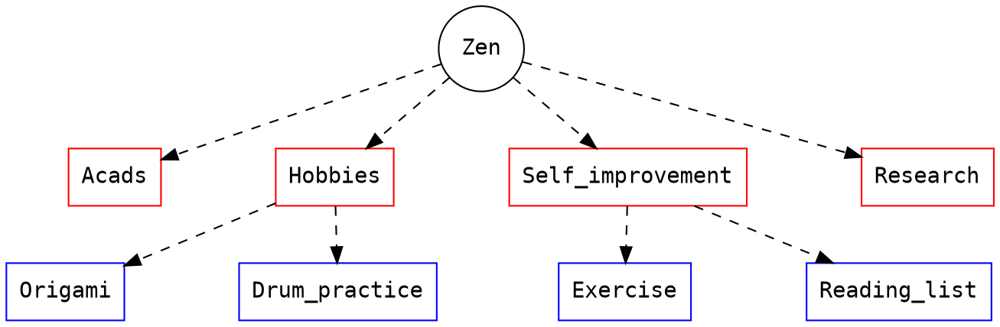

# CS251-2019 Outlab 9: Planner
*Android Programming*

## Submission instructions
:::danger
NEW!
:::

The build process of Android Studio creates a debug APK in the `app/build/outputs/apk/debug/` directory. You must upload the APK in addition to the complete project to Moodle.

You'll notice that your project directory will become quite large due to build artifacts. ***Use the following 4 liner to create the submission archive:***
```shell=bash
mkdir $TEAM_NAME-outlab9
git archive HEAD -o $TEAM_NAME-outlab9/planner-repo.tar
cp app/build/outputs/apk/debug/app-debug.apk $TEAM_NAME-outlab9/planner.apk
tar czf $TEAM_NAME-outlab9.tar.gz $TEAM_NAME-outlab9
```

We will download your submission and install it on your phone ourselves using:
```shell=bash
tar xzf $TEAM_NAME-outlab9.tar.gz
adb install -r -t $TEAM_NAME-outlab9/planner.apk
```
## Overview and concepts
You must design an android app that allows one to explore a shallow tree of information. In this assignment, you will be working with a tree of tasks (the `task-tree`).


We have provided a seed `task-tree` in JSON format that you must load into your app as soon as it is opened for the first time. This is called seeding. The tree has just 3 levels and we will restrict this assignment to three levels. Generalizing to arbitrary nesting would likely drown :ocean: your otherwise bright Diwali :fireworks: plans.

[Here's][tut] a simple to follow tutorial on how to make a simple Activity and manage a DB. It is worth your time to follow all the steps in it, even though the assignment diverges from it.

:::warning
If you're stuck with the inital project setup head [here](https://guides.codepath.com/android/Basic-Todo-App-Tutorial) or [here](https://developer.android.com/training/basics/firstapp/creating-project).
:::

[tut]: https://www.sitepoint.com/starting-android-development-creating-todo-app/

### Structure of the `task-tree`
Each task node has a title, description and possibly a scheduled date. A task node may have one or more sub-task nodes.
:::info
The $root$ task node is special, it's title is "Zen" and description is "If you chase two rabbits, you catch none."
:::



:::warning
In other words, we only have sub-tasks, tasks and a $root$.
:::

## Sidebar
The app sidebar has following options:
* [Home (all tasks)](#Home-activity)
  Leads to the main activity showing the root level task node.
* [Day view](#DayView-activity)
  Leads to an activity that shows only today's tasks in a "flat" manner (without nesting task nodes).
* About Us
  Is optional.
  
  <!---->
</img>

## `Home` activity
This is the default page of the application that shows all the task nodes. The activity has an add button on top, followed by a [`RecyclerView`][recycler] containing each task node in [`CardView`](https://developer.android.com/guide/topics/ui/layout/cardview)s.

</img>

### Adding more tasks
The add button on top of `Home` navigates the user to an `AddTask` activity or shows a popup that let's the user enter the title, description and scheduled date. The title is a mandatory field, and the date must be selected using a date picker.

Once the user hits `save`, you should commit the new task node to the DB and navigate back to the `Home` activity.

:::warning
You are free to choose between an activity or a popup for adding tasks.
:::

</img>

### Properties and actions in `Home`
1. Each task node is editable, the title description and even the scheduled date may be changed/set.
   > Make sure you refresh the [`RecyclerView`][recycler] after an edit is committed!
   :::success
   Hint: Try to utilize the same activity/popup you used for adding tasks.
   :::
2. (Single-tap) Expands the cards to show the task's description, and the list of title's of it's sub-tasks.
    - The task description should not consume more than four line heights when expanded. Show the $\ldots$ (ellipsis) when text overflows. 

</img>

3. (Double-tap) Anywhere on the task node navigates to the `TaskDetail`.


## `TaskDetail` activity
The activity has an add button on top, followed the description of the task **in full**. This is followed by a [`RecyclerView`][recycler] containing each sub-task node in [`CardView`][cardview]s.

</img>

### Adding sub-tasks
The add button on top of `TaskDetail` navigates the user to an `AddTask` activity or shows a popup that let's the user enter the title, description and scheduled date. The title is a mandatory field, and the date must be selected using a date picker.
:::success
You should be able to use the same activity/popup as the one used in `Home` to add tasks. Always try to be [DRY](https://en.wikipedia.org/wiki/Don't_repeat_yourself) when you write software.
:::

### Properties and actions in `TaskDetail`
1. Each sub-task node is editable, the title description and even the scheduled date may be changed/set.
   > Make sure you refresh the `RecyclerView` after an edit is committed!
   :::success
   Hint: Use the same edit activity.
   :::
2. (Single-tap) Expanding a card shows the sub-task's description.
    - The task description should not consume more than four line heights when expanded. Show the $\ldots$ (ellipsis) when text overflows.
3. (Double-tap) Navigates to the `SubTaskDetail` activity.

## `SubTaskDetail` activity
The activity has an edit button on top (instead of the add button), followed the description of the sub-task in full.
The only interaction here is the edit button.
:::danger
New: The edit action allows changing description and date.
:::


## `DayView` activity
1. At the very top of this activity is a date picker initialized to the current system date. Say this date is $d$.
2. The next element is a `RecyclerView` that holds cards of all task nodes that are scheduled for the date $d$. *See [below](#Computing-the-date-of-a-task-node) for an algorithm to decide the scheduled date of a task node*.

### Task nodes of the `DayView`
Instead of the hierarchical (nested) task node display, show a flat list of all task (and sub-task) nodes that meet our criterion.
In addition to the title of a task node, you must show the path $path(n)$ of the task node as well.
$$
path(n) = \begin{cases}
title(n) &\text{if}\ n = root \\
\texttt{concat}(``Z/",\ title(n)) &\text{otherwise}
\end{cases}
$$

</img>
</img>

:::info
The manner in which you show the path is immaterial as long as you show it somewhere in the card.
:::
### Computing the date of a task node
We've mentioned before that a "scheduled" date *maybe* (explicitly) set for a task node.

Thus, the date $d$ of any task/sub-task node $n$ is this explicitly set date, or the explicit date of the closest $parent^+(n)$. It's possible that a task node has no date in case none of it's parents' dates are set.
> The description tackles the generalized arbit nested `task-tree`, which is overkill for this assignment -- yet correct.
> $parent^+$ is application of $parent$ one or more times.
:::info
Note the distinction between an "explicit date" and just "date".
:::

### Properties and actions in `DayView`
1. Each task node is editable, the title description and even the scheduled date may be changed/set.
   > Make sure you refresh the [`RecyclerView`][recycler] after an edit is committed!
   > Hint: Use the same edit activity.
2. (Single-tap) Expanding the cards just shows their description, the list of it's children is omitted. This is uniform for both tasks and sub-tasks.
3. (Double-tap) Not implemented, because this is a flat-view of the task tree.

# Miscellaneous constraints
1. You must design a suitable database schema. We expect at least two tables with some foreign key constraints.
   We suggest the [Room][room] library, or the standard [SQLite][sqlite] library.
3. You must seed your app when it loads for the first time with the given seed data. There are standard ways to do this.
4. You don't need to specially handle the "back" button, default action suffices.
5. If a card is already in expanded state, then single tapping another one should shrink this card.
6. The date of a task/sub-task is shown on the card only if it is explicitly set.

# Suggested plan-of-action
Android programming may seem daunting at first, so here's a plan-of-action to hand-hold you for this assignment. *Our grading scheme is inspired from these steps as well.*

0. ***Do not start with layouting everything, do not beautify as you go along!***
1. Design the schema and make the seed work. Make ample use of the debug logging features of the Android framework. No UI elements yet.
2. Implement the add activity/popup in stages. First, just insert data into Database upon submit. No UI yet, so no UI updates yet.
4. Implement the [`CardView`][cardview] and [`RecyclerView`][recycler]. Fetch data from Database and populate the views.
5. Complete the add activity/popup by refreshing the `RecyclerView` upon submit.
6. Implement the single tap event handler for each item of `RecyclerView`. On single-tap, the [`CardView`][cardview] should expand.
7. Implement the `TaskDetail` activity, try to re-use as many components as you can.
8. Implement the double tap event handler for each item of `RecyclerView` by connecting it to the `TaskDetail` activity.
9. Do steps 3-7 for `TaskDetail`.
10. Implement `SubTaskDetail`.
11. Come up with the right queries for `DayView` and quickly test them out without creating UI elements for this activity.
12. Create and populate the UI elements for `DayView`.
13. Parameterize `DayView` on the date picker.
14. ***Work on layouts and tid-bits like ellipsis, icons, beautification and all that (stuff that you were tempted to do all along).***


# Seed data
:::danger
The seed data has been corrected (some deep nesting was removed!)
Spotted by: https://piazza.com/class/jysj6tzens7hz?cid=536#
:::
```json
{
  "name": "Zen",
  "description": "If you chase two rabbits, you catch none.",
  "tasks": [
    {
      "name": "Acads",
      "description": "Padhai ki baatein",
      "scheduled": "2019-12-31",
      "subtasks": [],
    },
    {
      "name": "Self improvement",
      "description": "Reading list, blogs, exercise, etc.",
      "scheduled": "2019-12-30",
      "subtasks": [
	{
	  "name": "Exercise",
	  "description": "someday?",
	  "scheduled": "2021-02-27",
	},
      	{
	  "name": "Reading list",
	  "description": "My bucket list:\nHear the Wind Sing\nThe Fountainhead\nAtlas Shrugged\nA prisoner of birth",
	  "scheduled": null,
	}
      ]},
    {
      "name": "Research",
      "description": "Pet projects",
      "scheduled": null,
      "subtasks": [],
    },
    {
      "name": "Hobbies",
      "description": "<3",
      "scheduled": null,
      "subtasks": [
	{
	  "name": "Origami",
	  "description": "cranes and tigers.",
	  "scheduled": "2019-10-29",
	},
	{
	  "name": "Drum practice!",
	  "description": "Aim:\nHallowed be thy name,\nAcid Rain (LTE)",
	  "scheduled": "2019-10-29",
	},
      ],
    }
  ]
}

```

[cardview]: https://developer.android.com/guide/topics/ui/layout/cardview
[recycler]: https://developer.android.com/guide/topics/ui/layout/recyclerview
[room]: https://developer.android.com/training/data-storage/room/
[sqlite]: https://developer.android.com/training/data-storage/sqlite.html